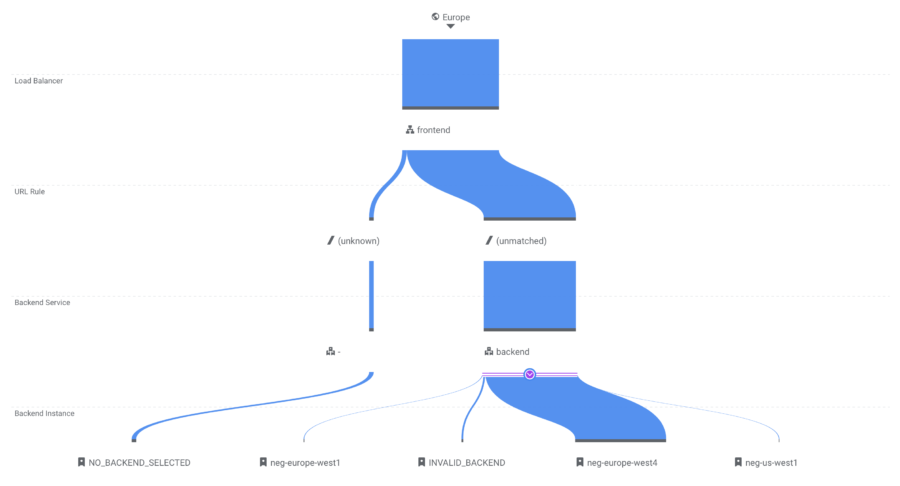

+++
date = 2022-01-11T08:41:01+01:00
title = "A minimal setup for a high availability service using Cloud Run"
tags = ["Google Cloud Platform", "Terraform"]
+++

This post [originally appeared on Binx.io](https://binx.io/2022/01/11/a-minimal-setup-for-a-high-availability-service-using-cloud-run/).

In this blog post, I will explain what is needed to set up a web service that runs in multiple GCP regions.
The main reasons to deploy your service in more than one region are:

* Handle single-region failures so that your application is highly available.
* Route traffic to the nearest region so your users experience faster loading times.

## Create Cloud Run deployments

A Cloud Run service only lives in a single region, so for a multi-region setup we will need to deploy the same container in multiple regions.
Luckily using a Terraform `for_each` loop, this does not add too much additional configuration:

```terraform
locals {
  locations = ["europe-west4", "europe-west1"]
}

resource "google_cloud_run_service" "service" {
  for_each = toset(local.locations)

  name     = "service-${each.key}"
  location = each.key

  ...
}
```

I recommend to use the name of the region in the name of the Cloud Run service so you can easily find them and guarantee uniqueness.

> We use `local.locations` to define the regions we want to deploy in so we can re-use that configuration in other resources.

## Set up load balancing ingress

By default, Cloud Run gives a service a publicly available `.run.app` URL.
However this points to a single Cloud Run service, and for a multi-region set we will need multiple services.
To do this, we will need to create a Global Load Balancer that uses [Serverless Network Endpoint Groups](https://cloud.google.com/load-balancing/docs/negs/serverless-neg-concepts) (NEGs) as backend.
These NEGs then route the traffic to the Cloud Run instances.

Let’s set up the needed resource for our ingress stack:

```terraform
resource "google_compute_global_address" "ip" {
  name = "service-ip"
}

resource "google_compute_region_network_endpoint_group" "neg" {
  for_each = toset(local.locations)

  name                  = "neg-${each.key}"
  network_endpoint_type = "SERVERLESS"
  region                = each.key

  cloud_run {
    service = google_cloud_run_service.service[each.key].name
  }
}

resource "google_compute_backend_service" "backend" {
  name     = "backend"
  protocol = "HTTP"

  dynamic "backend" {
    for_each = toset(local.locations)

    content {
      group = google_compute_region_network_endpoint_group.neg[backend.key].id
    }
  }
}

resource "google_compute_url_map" "url_map" {
  name            = "url-map"
  default_service = google_compute_backend_service.backend.id
}

resource "google_compute_target_http_proxy" "http_proxy" {
  name    = "http-proxy"
  url_map = google_compute_url_map.url_map.id
}

resource "google_compute_global_forwarding_rule" "frontend" {
  name       = "frontend"
  target     = google_compute_target_http_proxy.http_proxy.id
  port_range = "80"
  ip_address = google_compute_global_address.ip.address
}
```

> Notice how we are re-using local.locations to create the regional resources.

No one can call our service yet though, because we need to tell GCP that this is a public service that can be invoked by everyone:

```terraform
data "google_iam_policy" "noauth" {
  binding {
    role    = "roles/run.invoker"
    members = ["allUsers"]
  }
}

resource "google_cloud_run_service_iam_policy" "noauth" {
  for_each = toset(local.locations)

  service     = google_cloud_run_service.service[each.key].name
  location    = google_cloud_run_service.service[each.key].location
  policy_data = data.google_iam_policy.noauth.policy_data
}
```

## Deploy and call the service

Let’s add an output for the static IP address so we know what to call after deployment:

```terraform
output "static_ip" {
  value = google_compute_global_address.ip.address
}
```

Now run `terraform apply` to deploy everything and validate that it returns the "Hello World" container (for example using `curl $(terraform output --raw static_ip)`).

The Google Cloud Console also gives a nice visual overview of how the requests are routed:



Now you know how to deploy Google Cloud Run services in multiple regions!

## Bonus: enable Cloud CDN for even faster loading times

To prevent static assets from being served from your container, you can enable Cloud CDN to automatically serve these from Cloud Storage edge locations instead of the container itself.
Cloud CDN will automatically detect which routes are static resources, but you can manually override this configuration as well.

Simply add the `enable_cnd` flag to the backend service resource:

```terraform
resource "google_compute_backend_service" "backend" {
  name       = "backend"
  protocol   = "HTTP"
  enable_cdn = true

  ...
}
```

## Conclusion

By default, a single Cloud Run service can only be deployed in one region.
By using a global load balancer, we can deploy a Cloud Run service in multiple regions to bring high availability and low latency.
The `for_each` loop feature of Terraform makes this very easy to set up.

This post [originally appeared on Binx.io](https://binx.io/2022/01/11/a-minimal-setup-for-a-high-availability-service-using-cloud-run/).
